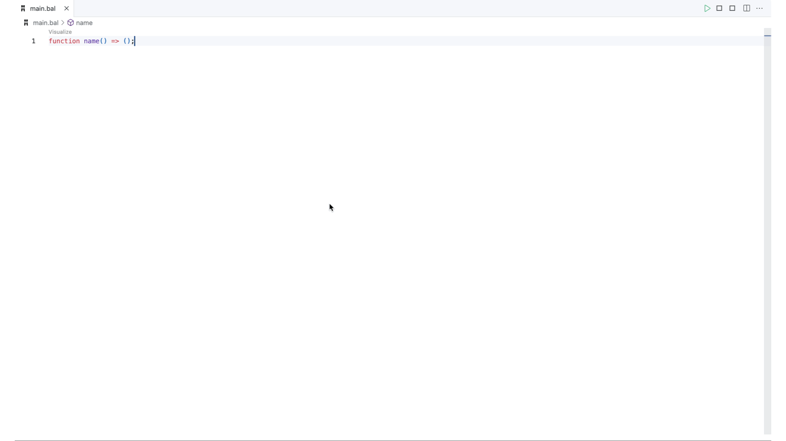

# Data Mapper

The Data Mapper of Ballerina is a tool designed to facilitate seamless data transformation through an user interface. When you engage with the Data Mapper via its interface, it automatically generates the necessary Ballerina source code to execute the data mapping. This feature ensures that the Ballerina source code serves as the single source of truth for the Visual Data Mapper, allowing you to open, edit, and manage existing data mappings crafted through the source code without compromising the user experience.

In the sections that follow, we will guide you through a practical scenario in which the Data Mapper is utilized to transform input records into a designated output record format. The process begins with launching the Data Mapper and initializing the input and output formats. Subsequently, we will conduct a test for the transformation function using a Ballerina. After implementing the transformation function, we will re-run the test to verify whether the transformation has been executed as anticipated.

## Sample use case

Imagine a scenario where you have records of **students** and the **courses** they are enrolled in, both in distinct formats. Your task is to transform these input records into a consolidated format that provides a comprehensive view of each student's details and their enrolled courses.

Below are the sample input json files:

**Input 1: Person**

```json
{
    "id": "1001",
    "firstName": "Vinnie",
    "lastName": "Hickman",
    "age": 15,
    "country": "UK"
}
```

**Input 2: Course**

```json
{
    "id": "CS6002",
    "name": "Computation Structures",
    "credits": 4
}
```
Your goal is to transform these inputs into the following output format:

**Output**

```json
{
    "id": "1001F",
    "fullName": "Vinnie Hickman",
    "age": "15",
    "courses": [
        {"title": "CS6002 - Computation Structures", "credits": 4}
    ],
    "totalCredits": 4,
    "visaType": "D-tier-4"
}
```

## Creating the transformation function

The Data Mapper allows you to visually map the input data structures to the expected output structure, generating the Ballerina code necessary for the transformation.

### Opening Data Mapper
You can open the Data Mapper through the **Visualize** CodeLens.

  1. In your `main.bal` file, define an empty expression-bodied function.
     ```ballerina
     function name() => ();
     ```
  2. Click the **Visualize** CodeLens displayed above the function to open the Data Mapper view.
     


### Defining inputs and output
After opening the Data Mapper, define the input and output records for the transformation function. Inputs and output can be any data type in Ballerina. This example converts JSON and an array of JSON to JSON, and thereby, you can use Ballerina record types as inputs and output.

In the Data Mapper form, you have several options to provide the input and output records. If the records are already defined in your package, you can select one of those. If you are starting from scratch, you can either create the record from the [Record Editor view](https://wso2.com/ballerina/vscode/docs/references/record-editor/) or import a JSON to create a matching record.

This example imports JSON files and creates the records as shown below.


## Testing the code

In Ballerina, it's a best practice to follow **Test Driven Development (TDD)**. Therefore, before we proceed with the implementation, we will write a test for this scenario to validate our code. It’s crucial to validate the data mapping functionality through testing. Below is a step-by-step guide on crafting and executing a Ballerina test to ensure the transformation function works as expected.

### Crafting the test
Create a Ballerina test file and write a test function (For more information on Ballerina Tests, check the following [documentation](https://ballerina.io/learn/test-ballerina-code/test-a-simple-function)). This function should invoke the `transform` function with sample `Person` and `Course` records, then assert whether the output matches the expected `Student` record.

Here’s a sample test function:

```ballerina
import ballerina/test;
import ballerina/io;

@test:Config {}
function testTransformFunction() returns error? {
    json testPersonJson = check io:fileReadJson("<path-to-person-json>");
    json testCoursesJson = check io:fileReadJson("<path-to-course-json>");
    json expectedStudentJson = check io:fileReadJson("<path-to-student-json>");

    Person testPerson = check testPersonJson.cloneWithType(Person);
    Course testCourse = check testCoursesJson.cloneWithType(Course);
    Student expectedStudent = check expectedStudentJson.cloneWithType(Student);

    Course[] testCourses = [testCourse];

    Student resultStudent = transform(testPerson, testCourses);
    test:assertEquals(resultStudent, expectedStudent, msg = "Test Failed!");
}
```

### Handling a Failing Test
Upon executing the test without applying any transformations to the input data, you will encounter a failing test. To achieve the expected outputs, let's proceed with writing our transformation function.

## Define the Mappings

For data transformation we have to map the input fields with the fields in the output. This can be done using the Data Mapper, which will generate the necessary Ballerina code for you. Here's an example of how a basic mapping could be done.


For a more comprehensive understanding of the Data Mapper's capabilities, please consult our [reference guides](./data-mapper-references/index.md).

## Constructing the Transformation Function
After mapping the input fields to the desired output format, your transformation function should resemble the following.

```bal
function transform(Person person, Course[] courses) returns Student => let var isForeign = person.country != "LK" in {
    id: person.id + (isForeign ? "F" : ""),
    age: person.age.toString(),
    fullName: person.firstName + " " + person.lastName,
    courses: from var coursesItem in courses
        where coursesItem.id.startsWith("CS")
        select {
            title: coursesItem.id + " - " + coursesItem.name,
            credits: coursesItem.credits
        },
    visaType: isForeign ? D_TIER_4_VISA : "n/a",
    totalCredits: courses.reduce(totalCredits, 0)
};
```

With the transformation function in place, we can now validate its correctness using the Ballerina test we crafted earlier.

### Verifying test success
Now, let's re-run the initial test. The output should now resemble the following.

```bash
Compiling source
    <user>/<package_name>:<version>

Running Tests

    <package_name>


        1 passing
        0 failing
        0 skipped
```

This output indicates that the `transform` function correctly transforms the input records into the desired output format.

## Conclusion

Through this practical scenario, you've gained experience in utilizing the Data Mapper in the Ballerina language. This tool aids in transforming input records into a specific output record format. The Data Mapper visually maps data structures and generates the necessary Ballerina code, providing an efficient method for data transformation tasks. This process is validated through testing to ensure reliability and precision.